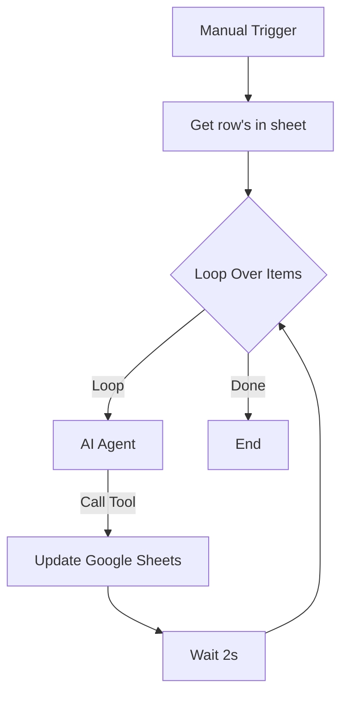

# 🔮 n8n AI Zodiac Assistant: 星座生肖自動化小幫手

這是一個將 **n8n AI Agent** 與 **Google Sheets** 深度整合的自動化工作流。它能讓 AI 自動讀取名單中的出生年月日，即時辨識星座與生肖並精準回填至雲端表格。

## 📖 流程簡介
本專案實現了以下核心邏輯：

* **數據抓取**：從 Google Sheet 提取「出生年月日」與對應的 `row_number`。
* **AI 推理 (Agent)**：AI 解析日期資料，計算出對應的星座 (Zodiac) 與生肖 (Chinese Zodiac)。
* **實時回填 (Update)**：AI 自動調用 Google Sheets 工具回傳結果。
* **批次執行**：透過 Loop 節點逐一處理資料，確保穩定性。

---

## 🔗 節點功能說明

### 1. Manual Trigger
手動點擊 **「Execute workflow」** 以啟動整個工作流程，適合測試或一次性批次處理。

### 2. Get row(s) in sheet
從指定的 Google Sheet（工作表名稱：**資料分類**）讀取所有資料列，作為後續處理的輸入來源。

### 3. Loop Over Items
核心的迴圈處理節點，將資料逐筆（或分批）處理，以避免短時間內大量 API 請求造成系統或服務過載。

### 4. AI Agent（OpenAI）
- **模型**：`gpt-4.1-mini`
- **系統指令**：  
  接收每筆資料中的「出身年月日」，並要求 AI **以繁體中文** 判斷並生成對應的：
  - 西洋星座（Zodiac）
  - 生肖（Chinese Zodiac）

### 5. Google Sheets Tool（Update）
當 AI Agent 完成判斷後，透過 `row_number` 精準匹配原始資料列，並自動更新以下欄位：
- `Zodiac`
- `Chinese Zodiac`

### 6. Wait
每次資料更新完成後，加入 **2 秒等待時間**，以降低 API 呼叫頻率，確保整體流程穩定執行。

---

## 📊 資料來源說明

本專案串接的 Google Sheets 表格結構包含以下欄位：

- `姓名`
- `出身年月日`
- `Zodiac`
- `Chinese Zodiac`

📎 **Google Sheets 連結**  
👉 點此查看資料分類表（https://docs.google.com/spreadsheets/d/1VH0DLck2SracCNge8S0NY08BTIYi866gt9klN7Ifgsc/edit?gid=1365293084#gid=1365293084）

---

## 🛠️ 安裝與使用方式

### 1️⃣ 匯入工作流
將專案提供的 `資料處理星座生肖.json` 檔案匯入至 n8n。

### 2️⃣ 設定憑證
- 設定 **OpenAI API Key**
- 設定 **Google Sheets OAuth2** 授權

### 3️⃣ 檢查試算表結構
確認 Google Sheet 內包含以下標題欄位：

- `姓名`
- `出身年月日`
- `Zodiac`
- `Chinese Zodiac`

### 4️⃣ 啟動工作流
點擊 **Execute workflow**，系統將自動：
- 判斷每筆資料的星座與生肖
- 回寫結果至對應欄位

---

## ✅ 適用場景

- 資料清洗與補全
- 表單回收後的批次處理
- 無法單純使用試算表公式的複雜判斷情境
- 結合 AI 的自動化資料處理流程示範

---

## 🏗️ 流程結構 (Workflow Structure)

### 視覺化流程圖

## 📸 執行截圖範例

